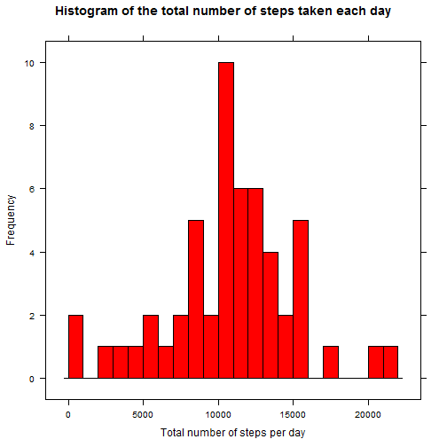
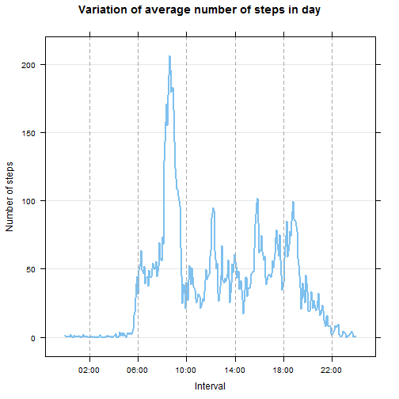
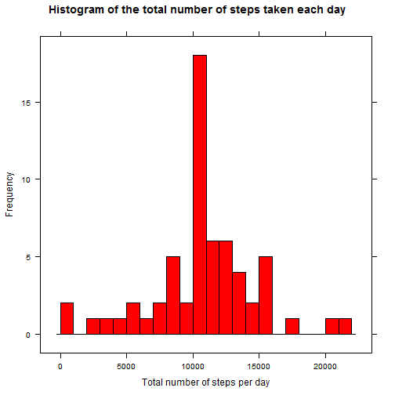
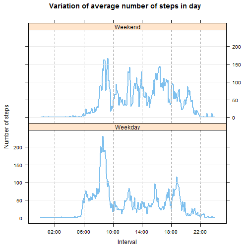

## Reproducible Research: Peer Assessment 1

This assignment makes use of data from a personal activity monitoring device. This device collects data at 5 minute intervals through out the day. The data consists of two months of data from an anonymous individual collected during the months of October and November, 2012 and include the number of steps taken in 5 minute intervals each day.


### Loading and preprocessing the data

#### 1. Loading Data:

Lattice graphic library is chosen for plotting. For apply operations plyr library is used. Both libraries are loaded at first. Data for the assignment is in the file 'activity.csv' which is contained in a zip container 'activity.zip.' The 'as.is = TRUE' option prevents the formation of factor variables and keeps the type of 'date' variable as character.


```r
library(lattice)
library(plyr)

data <- read.csv(con <- unz(normalizePath("activity.zip"), "activity.csv"), as.is = TRUE)
```

####  2. Process/ transform the data:

No process or transformation is required at this stage. The information in the file 'ativity.csv' is loaded into object variable 'data' as-is.


### What is mean total number of steps taken per day?

For this part of the assignment, the missing values in the dataset can be ignored. The dataset has three columns: 'steps', 'date' and 'interval'. Only the column 'steps' has missing values. A logical vector 'fltr' is calculated to filter out missing values.


```r
n <- nrow(data)
natable <- xtabs(~ col + isn,
      data = data.frame(col = c(rep("steps", n), rep("date", n), rep("interval", n)),
                        no  = c(1:n, 1:n, 1:n),
                        isn = c(is.na(data$steps), is.na(data$date), is.na(data$interval))))

fltr <- !is.na(data$steps)
print(natable)
```

```
##           isn
## col        FALSE  TRUE
##   date     17568     0
##   interval 17568     0
##   steps    15264  2304
```


#### 1. Histogram of the total number of steps taken each day:


```r
steps <- ddply(data[fltr,], c("date"), summarize, total = sum(steps))

histogram(steps$total, breaks = 20, col = "red", type = "count",
     main = "Histogram of the total number of steps taken each day",
     xlab = "Total number of steps per day",
     ylab = "Frequency")
```

 

#### 2. Mean and median total number of steps taken per day:

```r
mean =  mean(steps$total)
median = median(steps$total)
std = sd(steps$total)
```

Mean total number of steps taken per day is **10766.19** steps. Median total number of steps taken per day is **10765** steps.

### What is the average daily activity pattern?

#### 1. Time series plot:

Interval based statistics are calculated usind ddply function of plyr package. A function, int2timestr, is implemented to convert integer time interval to time string, in HH:MM format. Customizations for x axis ticks and labels of lattice graphics system are performed to obtain final plot.


```r
stats <- ddply(data[fltr,], c("interval"), summarize, mean = mean(steps), sd = sd(steps), median = median(steps))

int2timestr <- function(x) {
    hour <- floor(x / 100)
    minute <- x - 100 * hour 
    sprintf("%02d:%02d",hour, minute)
}

stats$time <- as.POSIXct(strptime(int2timestr(stats$interval),"%H:%M"))

xaxisticks <- seq( from = as.POSIXct(strptime("02:00","%H:%M")),
                   to = as.POSIXct(strptime("22:00","%H:%M")),
                   by = "4 hour" )

xaxislabels = list( at = xaxisticks, labels = format(xaxisticks, "%H:%M"))


xyplot(mean ~ time, data = stats,
       type = "l", col = "skyblue2", lwd = 2, scales = list( x = xaxislabels ),
       xlab = "Interval", ylab = "Number of steps",
       main = "Variation of average number of steps in day",
       panel = function(x, y, ...) {
           panel.grid(h=-1, v = 0)
           panel.xyplot(x, y, ...)
           panel.abline(v = xaxisticks, col = "darkgrey", lty = "dashed")
       })
```

 
#### 2. Interval containing the maximum number of steps:


```r
maxintervals <- stats$interval[which(stats$mean == max(stats$mean))]
ismulti <- length(maxintervals) > 1
```
The 5-minute interval, on average across all the days in the dataset, contains the maximum number of steps is **08:35**.

### Imputing missing values

#### 1. Total number of missing values in the dataset:

Missing values table has been previously obtained:


```r
print(natable)
```

```
##           isn
## col        FALSE  TRUE
##   date     17568     0
##   interval 17568     0
##   steps    15264  2304
```

Only 'steps' column has missing entries. There are 2304 missing values. **2304** rows (observations) have missing values out of 17568 rows.

#### 2. Strategy for filling in all of the missing values in the dataset:

Average values of steps over 5-minutes intervals are used to fill in missing values. Although distiribution of steps over 5-minute intervals are right skewed, interval statistics may be better estimates than daily statistics.

#### 3. New dataset that is equal to the original dataset but with the missing data filled in:


```r
data2 <- data
data2$steps[!fltr] <- stats$mean[match(data2$interval[!fltr], stats$interval)]
```


#### 4. Histogram, mean and median of the total number of steps taken each day:


```r
steps2 <- ddply(data2, c("date"), summarize, total = sum(steps))

histogram(steps2$total, breaks = 20, col = "red", type = "count",
     main = "Histogram of the total number of steps taken each day",
     xlab = "Total number of steps per day",
     ylab = "Frequency")
```

 

```r
mean2 =  mean(steps2$total)
median2 = median(steps2$total)
std2 = sd(steps2$total)
```

Mean total number of steps taken per day is **10766.19** steps. Median total number of steps taken per day is **10766.19** steps. These values don't differ from the estimates from the first part of the assignment. However, in the first part, standart deviation total number of steps, **4269.18**, is decreased to **3974.39**.

### Are there differences in activity patterns between weekdays and weekends?

#### 1. Create a new factor variable in the dataset:


```r
data2$day <- ifelse(strftime(data2$date, "%A") %in% c("Saturday", "Sunday"), "Weekend", "Weekday")
data2$day <- factor(data2$day)
```

#### 2.  Time series plot:


```r
stats2 <- ddply(data2, c("day", "interval"), summarize, mean = mean(steps), sd = sd(steps), median = median(steps))
stats2$time <- as.POSIXct(strptime(int2timestr(stats2$interval),"%H:%M"))

xyplot(mean ~ time | day, data = stats2, layout = c(1,2), 
       type = "l", col = "skyblue2", lwd = 2, scales = list( x = xaxislabels ),
       xlab = "Interval", ylab = "Number of steps",
       main = "Variation of average number of steps in day",
       panel = function(x, y, ...) {
           panel.xyplot(x, y, ...)
           panel.abline(v = xaxisticks, col = "darkgrey", lty = "dashed")
           panel.grid(h=-1, v = 0)
       })
```

 

Observations on the plot show that average number of steps on weekday mornings are greater than average number of steps on weekend mornings. However, average number of steps on weekday afternoons are less than average number of steps on weekend afternoons.
